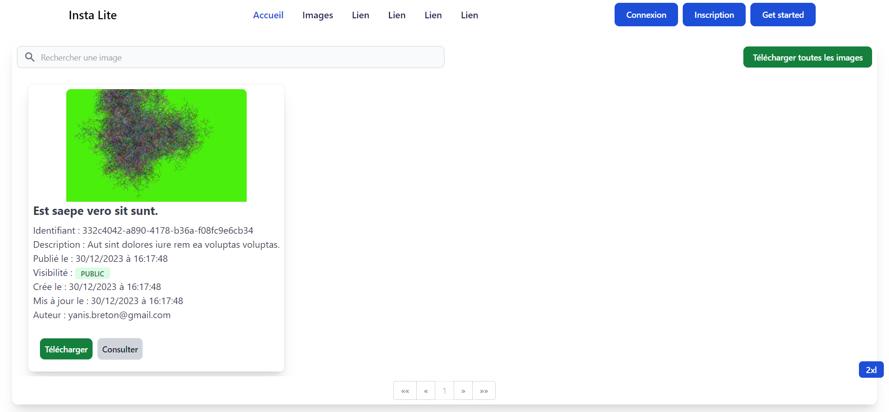
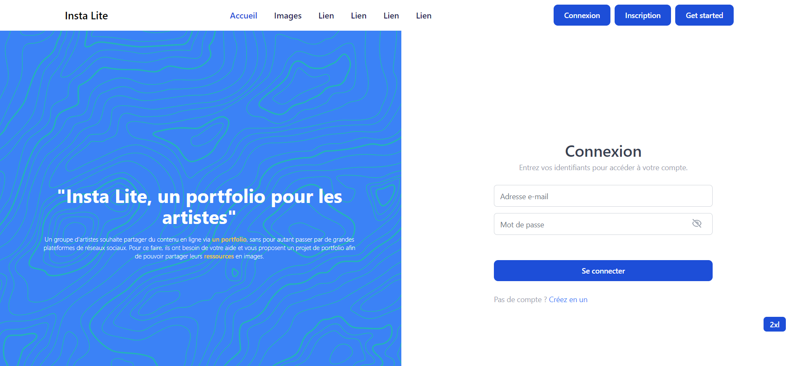
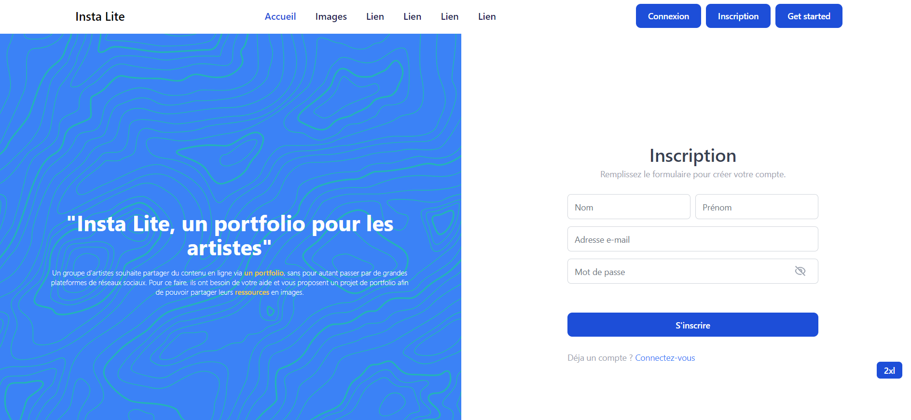
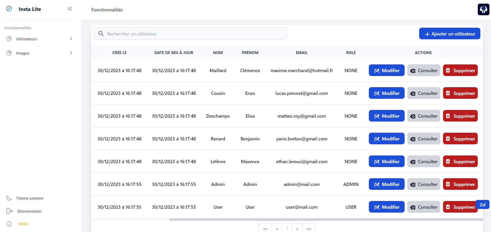
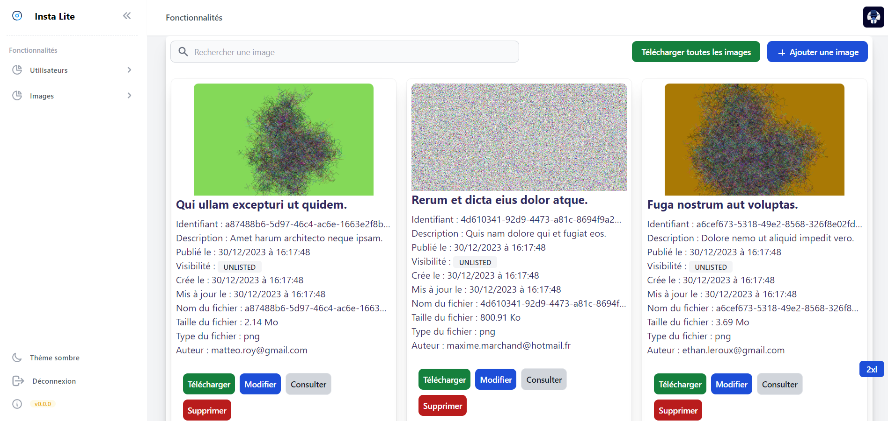
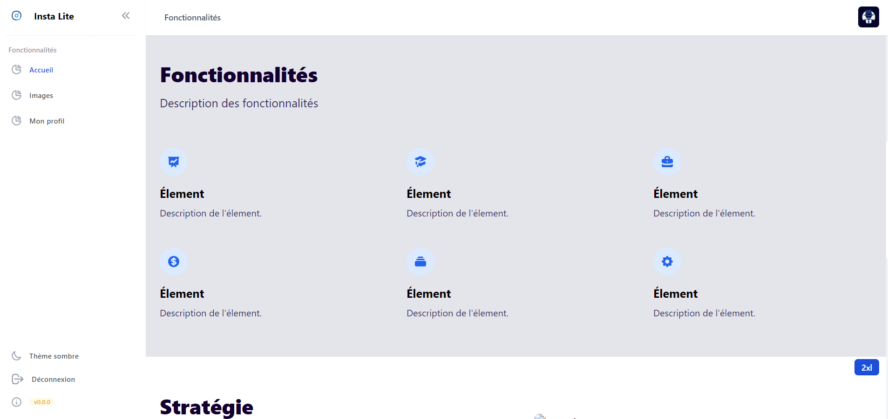
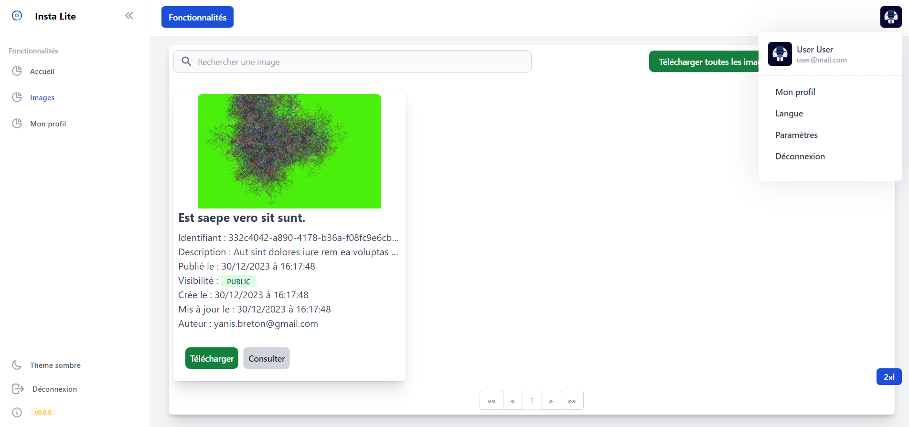
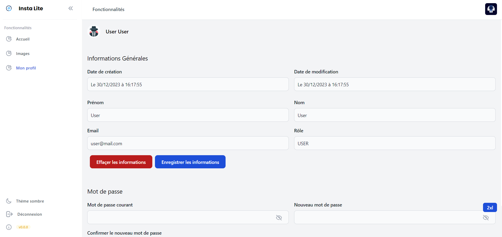
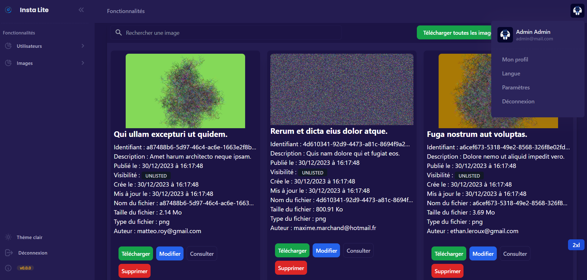

# Insta-lite Front-End

# Présentation

**Insta Lite (Front-end)** est [SPA](https://en.wikipedia.org/wiki/Single-page_application) qui permet la gestion d'images en ligne.

## Authentification

Au démarrage de l'application, deux comptes sont créés pour faciliter le processus d'authentification.
Ces comptes sont définis dans la méthode `commandLineRunner` de la classe `InstaliteApplication` situé dans le répertoire 
`src/main/java/fr/instalite`.

Compte administrateur :
	- **Email:** admin@mail.com
	- **Mot de passe:** Admin123456$

Compte utilisateur :
- **Email:** user@mail.com
- **Mot de passe:** User123456$

## Prévualisation 











## Installation

1. Clonez ce référentiel sur votre machine locale.
2. Ouvrez un terminal et naviguez vers le répertoire du projet.
3. Pour le back-end :
   - Assurez-vous d'avoir Docker installé.
   - Exécutez la commande `docker-compose up --build` pour lancer l'application back-end en utilisant Docker.
4. Pour le front-end :
   - Docker : 
      - Exécutez la commande `docker-compose up --build` pour lancer l'application front-end en utilisant Docker.
   - Local :
      - Exécutez la commande `npm install` pour installer les dépendances.
      - Exécutez la commande `ng serve` pour démarrer l'application front-end en mode de développement.

## Utilisation

- Ouvrez l'application front-end en accédant à l'URL (`http://127.0.0.1:4200/`).

## Technologies Utilisées

- [Angular](https://angular.io/): Angular est un framework JavaScript open-source développé par Google pour la création d'applications web dynamiques.
- [Docker](https://www.docker.com/): Docker est une plateforme de conteneurisation qui facilite le déploiement d'applications dans des conteneurs logiciels.

Les versions des outils qui ont été utilisés :
Vous pouvez les installer pour lançer ce projet.

- Node Package Manager (NPM) : 10.2.5
- Node JS : v20.10.0
- Angular : 16.2.0 (Présent dans le package.json)

# Informations complémentaires

Pour le ng-toast:
=> angular.json : "styles" => "node_modules/ngx-toastr/toastr.css"

## Licence

Ce projet est publié sous la licence MIT. Pour plus d'informations, consultez le fichier LICENSE.

[](https://choosealicense.com/licenses/mit/)

## Crédits

- Sanitize : https://stackoverflow.com/questions/54087739/angular-7-prevent-escaping-of-html-tags-inside-a-string-variable-passed-to-chil

# Crédits

- Logo : https://www.svgrepo.com/svg/418136/insta

# Informations complémentaires

- Les injections de dépendances : https://angular.io/guide/dependency-injection
- Les infos du projet se situent dans le fichier ```angular.json```
- Docker on a utilisé le nginx.conf : Le listen 4200; doit avoir le même port que celui de docker
- Tutoriel de déploiement : https://www.arunyadav.in/codehacks/blogs/post/19/create-an-angular-app-and-deploy-using-in-nginx-and-docker
- Le script pour renommer le contenu des fichiers, ainsi que leur nom et les répertoires se situe dans le répertoire ```utils``` de ce projet.

```
@Injectable({
  providedIn: 'root',
})
Pas d'injection dans le root level, l'injection se fait dans le providers afin 
de mieux comprendre les injections,
car si elles sont fait depuis le root level, elles sont alors disponible dans toutes
l'application et donc c'est pas très utile dans certains cas.
```

```bash
ng generate class MyClass --type=model
```
```bash
ng generate module features/user --routing
```
```bash
ng generate component features/user --module=features/user
```

This project was generated with [Angular CLI](https://github.com/angular/angular-cli) version 16.2.3.

## Development server

Run `ng serve` for a dev server. Navigate to `http://localhost:4200/`. The application will automatically reload if you change any of the source files.

## Code scaffolding

Run `ng generate component component-name` to generate a new component. You can also use `ng generate directive|pipe|service|class|guard|interface|enum|module`.

## Build

Run `ng build` to build the project. The build artifacts will be stored in the `dist/` directory.

## Running unit tests

Run `ng test` to execute the unit tests via [Karma](https://karma-runner.github.io).

## Running end-to-end tests

Run `ng e2e` to execute the end-to-end tests via a platform of your choice. To use this command, you need to first add a package that implements end-to-end testing capabilities.

## Further help

To get more help on the Angular CLI use `ng help` or go check out the [Angular CLI Overview and Command Reference](https://angular.io/cli) page.
